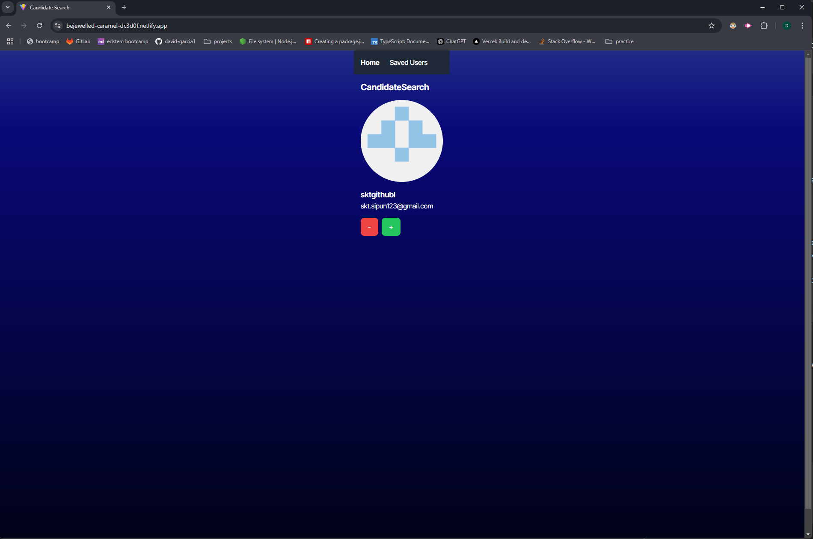

# GitHub Profile Finder

## Screenshots

---

**Link** to deployed site: https://searchforcandidates.netlify.app/

---
## Description
GitHub Profile Finder is an intuitive web application that allows users to search for GitHub profiles, navigate through search results, and save or remove profiles for future reference. This project combines a sleek interface with robust functionality, making it a powerful tool for developers, recruiters, or anyone interested in exploring GitHub profiles.

---

## Features
- **Search GitHub Profiles**: Quickly find GitHub profiles using the integrated search feature.
- **Navigate Results**: Browse through search results effortlessly with a 'Next' button to view more profiles.
- **Save Profiles**: Save profiles you find interesting for future reference.
- **Delete Profiles**: Remove profiles from your saved list when they're no longer needed.

---

## Technologies Used
- **Frontend**: React, TailwindCSS
- **Backend**: Node.js, Express.js
- **API**: GitHub REST API

---

## Acknowledgements
- [GitHub REST API Documentation](https://docs.github.com/en/rest)
- [React Documentation](https://reactjs.org/docs/)
- [Node.js Documentation](https://nodejs.org/en/docs/)

---

## Contact
For questions or feedback, feel free to contact:
- **Name**: David Garcia
- **Email**: davidspgarcia99@gmail.com
- **GitHub**: [david-garcia1](https://github.com/david-garcia1)
